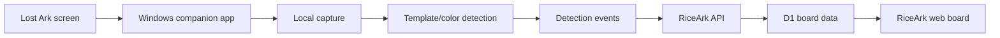

# RiceArk Lost Ark Companion App Design

## Status

This document is a product and technical design for a future Windows companion app.
Implementation is intentionally deferred.

The first implementation goal is to reproduce the useful behavior of the reference raid checklist app: watch the user pressing `Alt+Q` or `ESC`, capture the Lost Ark status screen, detect completed content from the screen, and reflect matching checklist completions in RiceArk.

The preferred implementation is clean-room RiceArk code and RiceArk-owned templates/calibration data. The reference app is used to understand the interaction model and image-recognition strategy, not as a dependency that RiceArk ships unchanged.

## Goals

- Let a Windows user keep RiceArk checklist state in sync with Lost Ark status screens.
- Support the common user flow: user opens Lost Ark content status with `Alt+Q` or `ESC`, then RiceArk detects completed homework.
- Keep screenshots local by default. RiceArk servers should receive detection results, not raw screen captures.
- Make detection explainable enough that users can understand and correct mistakes.
- Start with weekly raid-style completion detection before expanding to every daily and event content type.
- Preserve RiceArk data safety: custom board layout, row/column orientation, hidden checkboxes, and manual user edits must not be corrupted by the companion app.

## Non-Goals

- Reading Lost Ark process memory, network packets, save files, or protected game state.
- Automating game inputs or gameplay.
- Uploading screenshots to the server as the normal sync path.
- Replacing the website UI.
- Supporting macOS. Lost Ark itself is Windows-first, so the companion app is Windows-only.
- Solving all OCR cases in the first version.
- Copying the reference app's entire feature set, Firebase sharing, friend boards, startup behavior, or unrelated UI.

## Reference App Findings

The reference executable in `ref/Raidcheck.v3.7.6.exe` was inspected statically. It was not executed.

Observed properties:

- It appears to be a Python 3.14 PyInstaller Windows GUI app.
- It uses libraries consistent with screen capture and image processing:
  - `PIL.ImageGrab`
  - `cv2`
  - `numpy`
  - `keyboard`
  - `pystray`
  - `customtkinter`
  - `pywin32`
- It does not appear to rely on game memory or packet inspection.
- It uses global hotkeys:
  - `ESC`
  - `Alt+Q`
- It captures the full virtual screen after a configurable delay.
- It performs OpenCV template matching across multiple scales.
- It identifies the current character through a saved character-name image template.
- It detects raid labels with small image templates.
- It detects completion mostly through green status pixels and a `참여 완료` style text template.
- It has a special `Alt+Q` path for content such as `할의 모래시계`.

Important inferred detection concepts:

- `ESC` path:
  - Capture screen.
  - Match current character nameplate template.
  - Use the character location as an anchor.
  - Match known raid label templates around the expected content list.
  - Search right side of each detected row for green completion indicators or completion text.
  - Update the local status for the current character.
- `Alt+Q` path:
  - Capture screen.
  - Match specific content label.
  - Inspect the matched area for green pixels.
  - Cache or apply the result when the character is known.

This is a good starting model for RiceArk because it is simple, local, and explainable.

## Recommended Product Behavior

### First Version Scope

The first version should focus on:

1. Windows tray companion app.
2. Global hotkey watching for `ESC` and `Alt+Q`.
3. Full-screen capture after a short delay.
4. Character detection from user-calibrated character name templates.
5. Known Lost Ark raid/homework label detection through templates.
6. Completion detection through color/template matching.
7. Syncing completed detections to RiceArk.
8. A small local history panel showing what was detected and what was applied.

### Detection Result Policy

The safest first version should be completion-positive by default:

- If the companion confidently detects that a task is completed, it may check the matching RiceArk cell.
- If it detects incomplete or cannot detect a task, it should not automatically uncheck RiceArk.

Reason:

False negatives are likely during early image-recognition tuning. Automatically unchecking user data would be more damaging than missing a completion.

A later advanced setting can offer full sync:

- `완료만 반영`
- `완료/미완료 모두 반영`

The default should stay `완료만 반영`.

### Confidence Handling

Each detection should have a confidence score.

Suggested thresholds:

- `>= 0.85`: auto-apply if mapping is unambiguous.
- `0.70 - 0.85`: show as a candidate in the local app, do not auto-apply.
- `< 0.70`: ignore or show only in debug logs.

These numbers should be configurable during development, but the user-facing first version can expose a simple sensitivity setting:

- 안정
- 보통
- 민감

## User Flow

### Pairing

1. User logs into RiceArk in the browser.
2. User opens a future `동반 앱 연결` screen.
3. RiceArk creates a short-lived pairing code.
4. User opens the Windows companion app and enters the code.
5. The app exchanges the code for a device token.
6. RiceArk shows the connected device and lets the user revoke it later.

Pairing codes should expire quickly, for example after 10 minutes.

### Calibration

The companion app needs initial calibration because users have different resolutions, UI scale, monitors, and Lost Ark layouts.

Minimum calibration:

1. User selects a RiceArk character.
2. User opens Lost Ark's `ESC` status screen.
3. The app asks the user to capture the visible character name area.
4. The app stores a local image template for that character.

Optional later calibration:

- Re-capture a character template.
- Capture a custom task label template.
- Test current screen against all templates.
- Show matched boxes for debugging.

### Normal Use

1. Companion app runs in tray.
2. User plays Lost Ark normally.
3. User presses `ESC` or `Alt+Q`.
4. Companion waits for the configured capture delay.
5. Companion captures the current screen.
6. Companion detects current character and completed contents.
7. Companion maps detections to RiceArk task keys.
8. Companion sends only changed completion events to RiceArk.
9. RiceArk applies safe matches and rejects ambiguous or invalid matches.
10. User can see a short local log:
    - `냠수나이스1 / 4막 / 완료 / 반영됨`
    - `냠수나이스1 / 종막 / 후보 / 신뢰도 낮음`
    - `캐릭터 식별 실패`

## Architecture



### Components

#### Windows Companion App

Responsibilities:

- Global hotkey detection.
- Delayed screen capture.
- Template and color matching.
- Local character/template calibration.
- Local detection history.
- RiceArk device pairing.
- Sending detection events.

Recommended future tech stack:

- Preferred production path: .NET 8 Windows desktop app with OpenCvSharp and native Win32 hotkey/screen APIs.
- Fast prototype path: Python with OpenCV and PyInstaller.

The reference app is Python/PyInstaller, so Python is fastest for prototyping. For a public-facing RiceArk companion app, .NET is likely better for installer quality, signing, update handling, and avoiding a very large bundled Python runtime.

#### RiceArk API

Responsibilities:

- Pairing code creation and exchange.
- Device token validation.
- Device revocation.
- Sync context delivery.
- Detection event ingestion.
- Safe mapping from detection keys to current user's board cells.
- Applying completion patches.

#### RiceArk Web

Responsibilities:

- Show connected companion devices.
- Start/revoke pairing.
- Configure which RiceArk tasks are eligible for companion sync.
- Show recent companion sync results.
- Let users resolve ambiguous mappings.

## Data Model Additions

### Companion Devices

Suggested table: `companion_devices`

Fields:

- `id`
- `user_id`
- `device_name`
- `token_hash`
- `created_at`
- `last_seen_at`
- `revoked_at`

The raw token should never be stored.

### Pairing Codes

Suggested table: `companion_pairing_codes`

Fields:

- `id`
- `user_id`
- `code_hash`
- `expires_at`
- `used_at`
- `created_at`

### Detection Mappings

RiceArk should not rely only on visible user labels, because users can rename tasks freely.

Suggested approach:

- Add an optional detector key to task axis items or task metadata.
- Examples:
  - `lostark.raid.act4`
  - `lostark.raid.kazeroth_finale`
  - `lostark.raid.serca`
  - `lostark.raid.heaven`
  - `lostark.raid.proving`

Users can still name a task anything they want, such as `쌀`, `4막`, or `막차`. The detector key links that custom task to a known Lost Ark screen element.

For custom tasks without detector keys, the companion app should not auto-map them unless the user explicitly creates a custom detection mapping.

## API Sketch

### Create Pairing Code

`POST /api/companion/pairing-codes`

Authenticated browser route.

Response:

```json
{
  "code": "123456",
  "expiresAt": "2026-06-09T12:10:00.000Z"
}
```

### Exchange Pairing Code

`POST /api/companion/devices/exchange`

Request:

```json
{
  "code": "123456",
  "deviceName": "DESKTOP"
}
```

Response:

```json
{
  "deviceToken": "opaque-token",
  "deviceId": "device-id"
}
```

### Load Sync Context

`GET /api/companion/sync-context`

Device-token route.

Response includes only data needed by the companion:

- Characters:
  - character id
  - real character name
  - display name
  - server
- Eligible tasks:
  - detector key
  - task label
  - reset type
  - table and cell mapping summary
- Version number for caching.

### Submit Detections

`POST /api/companion/detections`

Request:

```json
{
  "capturedAt": "2026-06-09T12:00:00.000Z",
  "trigger": "ESC",
  "characterName": "냠수나이스1",
  "characterConfidence": 0.93,
  "detections": [
    {
      "detectorKey": "lostark.raid.act4",
      "label": "4막 : 아르모체",
      "status": "completed",
      "confidence": 0.91
    }
  ]
}
```

Response:

```json
{
  "applied": [
    {
      "characterName": "냠수나이스1",
      "detectorKey": "lostark.raid.act4",
      "completed": true
    }
  ],
  "skipped": []
}
```

The server should validate:

- Device token is valid and not revoked.
- Character belongs to the same user.
- Detector key is mapped to one or more eligible tasks for that user.
- Checkbox is visible.
- The target board is not read-only.
- The completion period key is current.
- The target is not ambiguous unless the user has configured multi-target apply.

## Image Detection Design

### Capture

Use the full virtual screen so multi-monitor setups can work.

Capture delay should be configurable:

- 초고속: about 0.3s
- 빠름: about 0.5s
- 안정: about 1.2s
- 느림: about 2.0s

Default should be 안정.

### Template Matching

Use OpenCV `matchTemplate` with normalized correlation.

Scale search:

- Match each template across a range around the current UI scale.
- Suggested initial range: `0.75` to `1.15`.
- Store last successful scale and reuse it as a hint for faster scans.

### Character Detection

Each calibrated character has a small local template image.

Detection:

1. Convert screen and templates to grayscale.
2. Match every character template.
3. Pick the highest score.
4. Accept only above a threshold, for example `0.80`.

If multiple characters are close in score, do not apply automatically.

### Task Label Detection

Known detector keys have task label templates.

Examples for first-version detector keys:

- `lostark.raid.act4`
- `lostark.raid.kazeroth_finale`
- `lostark.raid.serca`
- `lostark.raid.cathedral`
- `lostark.raid.paradise_heaven`
- `lostark.raid.paradise_trial`

Task labels should be matched near the detected character/status panel region when possible, not across the entire screen blindly.

### Completion Detection

Use a combination of:

- Green status mask in HSV color space.
- Completion text template.
- Content-specific counter template, only where needed.

The first version should store detection evidence locally:

- matched label
- match confidence
- completion match type
- approximate bounding box

No screenshot upload is needed.

## RiceArk Board Mapping Rules

RiceArk boards are customizable, so the companion app must not assume:

- characters are always columns,
- tasks are always rows,
- visible labels match Lost Ark labels,
- every task applies to every character.

The server should map detections through stable ids:

1. Find the current user from the device token.
2. Find the character by real Lost Ark name.
3. Find task axis items with a matching detector key.
4. For each candidate table, find the cell that combines the character axis item and task axis item.
5. Apply completion only if the checkbox is visible.
6. Use RiceArk's existing reset-period calculation.

If the task exists in multiple tables, the first version should apply to all visible eligible cells unless the user disables that in settings.

Suggested future setting:

- Apply to all matching tables.
- Apply only to selected tables.

Default can be all matching tables because many users duplicate the same task across compact views.

## Safety Rules

- Do not uncheck by default.
- Do not write to shared/read-only views.
- Do not apply detections if character confidence is low.
- Do not apply detections if detector mapping is ambiguous and the user has not allowed multi-target apply.
- Do not apply to hidden checkboxes.
- Do not mutate table layout, task names, character names, or display options.
- Rate-limit device sync to prevent accidental spam.
- Store raw screenshots only locally and only if the user enables debug mode.
- Let users revoke a companion device from the website.

## UX Requirements

### Web UI

Future web areas:

- Profile menu or settings entry: `동반 앱`
- Connected devices list.
- Pairing code screen.
- Recent sync results.
- Detector mapping management for tasks.

Task edit UI can later show:

- `동반 앱 감지 대상`
- `4막 : 파멸의 성채`
- `종막 : 최후의 날`
- `세르카`
- etc.

### Companion App UI

Minimum UI:

- Current status:
  - 감시 중
  - 일시정지
  - RiceArk 연결됨
  - RiceArk 연결 필요
- Capture delay setting.
- Detection sensitivity setting.
- Character calibration list.
- Recent detection log.
- Manual rescan button.
- Pause/resume button.

Tray actions:

- 열기
- 감시 일시정지
- 설정
- 종료

## Testing Plan

### Offline Detector Tests

Use saved test screenshots, not live game state.

Test cases:

- 1920x1080 borderless.
- 2560x1440 borderless.
- Multi-monitor virtual screen.
- Different UI scale.
- Completed raid row.
- Incomplete raid row.
- Character detection success.
- Character detection ambiguous.
- Unknown screen.

### API Tests

Cover:

- pairing code creation,
- expired pairing code rejection,
- device token exchange,
- revoked device rejection,
- sync context loading,
- completion event apply,
- hidden checkbox skip,
- unknown detector skip,
- unknown character skip,
- duplicate detection dedupe,
- completion-only default behavior.

### Web Tests

Cover:

- device list,
- pairing code display,
- revoke device,
- task detector mapping display,
- sync result messages.

### Manual Verification

Before release:

- Run with Lost Ark in borderless fullscreen.
- Run with Lost Ark on a second monitor.
- Press `ESC` repeatedly.
- Press `Alt+Q` repeatedly.
- Confirm no duplicate spam.
- Confirm no screenshots leave the PC.
- Confirm RiceArk updates only expected checkboxes.
- Confirm hidden checkboxes stay untouched.

## Rollout Plan

### Phase 0: Planning Only

This document.

### Phase 1: Offline Detector Prototype

Build a local detector that accepts screenshot files and outputs JSON detections.

No RiceArk account connection yet.

Success criteria:

- Detect current character from calibration templates.
- Detect a small set of known raid labels.
- Detect completed status with acceptable confidence.

### Phase 2: Local Companion Prototype

Add Windows capture and hotkey watching.

Still no auto-write to RiceArk.

Success criteria:

- User can press `ESC`.
- App logs detected character and completed contents.
- False positives are low enough to continue.

### Phase 3: RiceArk Pairing And Preview Sync

Add device pairing and send detections to RiceArk.

RiceArk shows detections as preview or log.

Success criteria:

- Device can be paired and revoked.
- Detections are associated with the correct user.
- No board data is changed unless the path is explicitly enabled.

### Phase 4: Completion Apply

Enable completion-positive auto-apply.

Success criteria:

- Completed detections check matching visible RiceArk cells.
- Incomplete detections do not uncheck by default.
- Locked layout and read-only shared views are respected.

### Phase 5: Public Beta

Package the app for trusted users.

Success criteria:

- Installer/update path is acceptable.
- App does not trigger excessive antivirus warnings.
- Logs are useful for support.
- Users can recover from bad calibration without support intervention.

## Open Questions For Later

- Should first public build be Python for speed or .NET for distribution quality?
- Should detection templates be bundled, user-calibrated, or both?
- Should companion sync apply to all matching tables or only selected tables?
- Should full sync be allowed to uncheck RiceArk cells, or should RiceArk always remain completion-positive from companion input?
- How much local debug evidence should be retained, and for how long?
- How will template updates be distributed when Lost Ark UI changes?

## Recommendation

When implementation eventually starts, build the system in this order:

1. Offline screenshot detector.
2. Character calibration.
3. Known raid detector templates.
4. Local hotkey capture.
5. RiceArk pairing.
6. Completion-positive sync.

This keeps the risky part, image recognition, isolated from the server and board data until it proves reliable.
